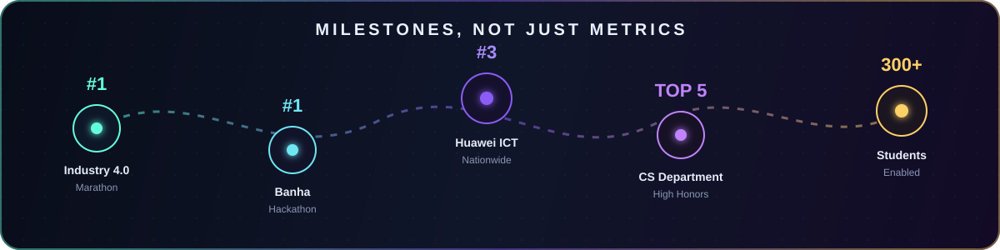

<p align="center">
  
</p>

<p align="center">
  <a href="#featured-builds">Selected work</a> &nbsp;•&nbsp;
  <a href="#engineering-toolkit">Toolkit</a> &nbsp;•&nbsp;
  <a href="#proof-of-impact">Impact</a> &nbsp;•&nbsp;
  <a href="#lets-build-something-meaningful">Contact</a>
</p>

<p align="center">
  <a href="https://www.linkedin.com/in/ahmed-elsa3dany/"></a>
  <a href="mailto:ahmedelsaadany16112003@gmail.com"></a>
  
  
</p>

## The short version

I am a **Flutter engineer and product-minded software developer** who turns ambitious ideas into polished mobile experiences. My work sits where **mobile engineering, thoughtful UX, AI, and education** meet.

I graduated in Computer Science - Software Engineering from New Mansoura University with **Excellent with High Honors**, ranked **5th in my department**, and built award-winning products recognized at national competitions.

> I care about the entire product journey: the problem, the architecture, the smallest interaction, and the moment a real person finally uses it.

## Featured builds

<table>
  <tr>
    <td width="50%" valign="top">
      <h3>✨ Sparkly Fun</h3>
      <p><strong>AI-powered learning, designed around curiosity.</strong></p>
      <p>An interactive educational ecosystem for children, combining an intelligent tutor, object detection, stories, mind maps, games, and personalized activities.</p>
      <p><code>Flutter</code> <code>BLoC/Cubit</code> <code>Supabase</code> <code>Gemini API</code> <code>Clean Architecture</code></p>
      <p>🥇 Industry 4.0 Marathon &nbsp;•&nbsp; 🎓 Top 10 graduation project</p>
      <p><a href="https://github.com/AhmedElsa3dany/Sparkly_Fun_Landingpage"><strong>Explore the experience →</strong></a></p>
    </td>
    <td width="50%" valign="top">
      <h3>🌌 NASA Exoplanet Explorer</h3>
      <p><strong>Turning space data into an approachable mobile journey.</strong></p>
      <p>A responsive Flutter experience that consumes remote APIs and presents exoplanet information through reusable, asynchronous UI flows.</p>
      <p><code>Flutter</code> <code>REST APIs</code> <code>Async</code> <code>Data Visualization</code></p>
      <p><br><a href="https://github.com/AhmedElsa3dany/nasa-space-app"><strong>View repository →</strong></a></p>
    </td>
  </tr>
  <tr>
    <td width="50%" valign="top">
      <h3>📚 BookNest</h3>
      <p><strong>A calm, scalable reading experience.</strong></p>
      <p>A book discovery application shaped around maintainable presentation logic, reusable components, and a clean mobile interface.</p>
      <p><code>Flutter</code> <code>MVVM</code> <code>BLoC</code> <code>Repository Pattern</code></p>
      <p><a href="https://github.com/AhmedElsa3dany/Book_Nest"><strong>View repository →</strong></a></p>
    </td>
    <td width="50%" valign="top">
      <h3>⏳ Time Machine</h3>
      <p><strong>History explored as a visual journey.</strong></p>
      <p>An experimental Flutter experience for travelling through eras using immersive motion, video assets, and narrative UI.</p>
      <p><code>Flutter</code> <code>Motion</code> <code>Video</code> <code>Visual Storytelling</code></p>
      <p><a href="https://github.com/AhmedElsa3dany/Time-Machine"><strong>View repository →</strong></a></p>
    </td>
  </tr>
</table>

<details>
  <summary><strong>More products I have built</strong></summary>
  <br>
  <ul>
    <li><strong>Qalb Dakhir</strong> - an offline-first Arabic adhkar, prayer-time, qibla, and reflection experience. <em>Source kept private by design.</em></li>
    <li><strong>Smile</strong> - assistive learning and communication for children with autism; 1st place at the Banha Hackathon.</li>
    <li><strong>NutriMind</strong> - AI-assisted health and nutrition recommendations; Top 10 from approximately 200 IEEE competition teams.</li>
    <li><strong>Nex News, EduManager, Moodly, Between Us</strong> - focused experiments in content, education, wellbeing, and social experiences.</li>
  </ul>
</details>

## Engineering toolkit

<div align="center">
  
</div>

<br>

| Mobile craft | Architecture | Data & intelligence | Product delivery |
|---|---|---|---|
| Flutter, Dart, responsive UI, animation, notifications | Clean Architecture, BLoC/Cubit, MVVM, SOLID, Repository Pattern | Supabase, Firebase, REST, JSON, SQLite, Gemini API, object detection | Requirements, prototyping, testing, documentation, Git workflows |

```dart
final wayIWork = ProductMindset(
  startWith: Problem.real,
  architecture: Architecture.clean,
  experience: Experience.intentional,
  finishWhen: Product.useful,
);
```

## Proof of impact

<p align="center">
  
</p>

| Signal | Outcome |
|---|---|
| 🥇 Industry 4.0 Marathon | 1st place for Sparkly Fun's innovation and educational impact |
| 🥇 Banha Hackathon | 1st place for Smile, an assistive app for children with autism |
| 🥉 Huawei ICT Academy | 3rd nationwide among 46 university teams; qualified for North Africa |
| 🎓 Academic excellence | 5th in the CS department, GPA 3.54/4.00, Excellent with High Honors |
| 🚀 Community leadership | Helped 300+ students access Huawei certification opportunities |

## Beyond the code

I have worked as a **Huawei Cloud Student Ambassador**, **Head of Operations at Microsoft Student Club NMU**, **Vice President at Rally NMU**, and a trainer in youth-development communities. Those roles taught me that strong software is also about clear communication, ownership, and helping a team move together.

I am especially interested in **AI in education, educational technology, human-computer interaction, assistive technology, and teaching programming to young learners**.

## GitHub signal

<p align="center">
  
</p>

<p align="center">
  
  
</p>

## Let's build something meaningful

If you are working on a mobile product, an AI-enhanced learning experience, or technology with genuine human impact, I would love to hear about it.

<p align="center">
  <a href="mailto:ahmedelsaadany16112003@gmail.com"></a>
  <a href="https://www.linkedin.com/in/ahmed-elsa3dany/"></a>
</p>

<p align="center">
  
</p>

