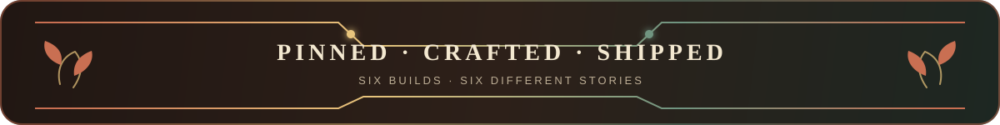
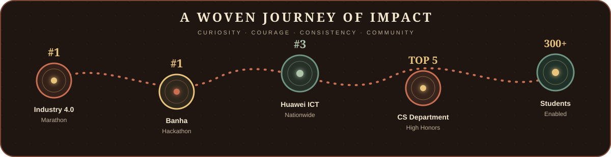

<p align="center">
  
</p>

<p align="center">
  <a href="#featured-builds">Selected work</a> &nbsp;•&nbsp;
  <a href="#engineering-toolkit">Toolkit</a> &nbsp;•&nbsp;
  <a href="#proof-of-impact">Impact</a> &nbsp;•&nbsp;
  <a href="#lets-build-something-meaningful">Contact</a>
</p>

<p align="center">
  <a href="https://www.linkedin.com/in/ahmed-elsa3dany/"></a>
  <a href="mailto:ahmedelsaadany16112003@gmail.com"></a>
  
  
</p>

## The short version

I am a **Flutter engineer and product-minded software developer** who turns ambitious ideas into polished mobile experiences. My work sits where **mobile engineering, thoughtful UX, AI, and education** meet.

I graduated in Computer Science - Software Engineering from New Mansoura University with **Excellent with High Honors**, ranked **5th in my department**, and built award-winning products recognized at national competitions.

> I care about the entire product journey: the problem, the architecture, the smallest interaction, and the moment a real person finally uses it.

## Featured builds

<p align="center">
  
</p>

<table>
  <tr>
    <td width="50%" valign="top">
      <h3>📚 Book_Nest</h3>
      <p><strong>A calm home for curious readers.</strong></p>
      <p>A book discovery experience built with clean boundaries, reusable UI, fast API flows, and thoughtful loading states.</p>
      <p><code>Flutter</code> <code>BLoC</code> <code>Dio</code> <code>GetIt</code> <code>GoRouter</code></p>
      <p><a href="https://github.com/AhmedElsa3dany/Book_Nest"><strong>Walk into the project →</strong></a></p>
    </td>
    <td width="50%" valign="top">
      <h3>🪄 Kidventure-App</h3>
      <p><strong>Learning that feels like exploration.</strong></p>
      <p>An educational Flutter world for children aged 6-12, blending 3D objects, Gemini-powered conversation, voice interaction, charts, and playful motion.</p>
      <p><code>Flutter</code> <code>Gemini AI</code> <code>3D</code> <code>Speech</code> <code>TTS</code></p>
      <p><a href="https://github.com/AhmedElsa3dany/Kidventure-App"><strong>Begin the adventure →</strong></a></p>
    </td>
  </tr>
  <tr>
    <td width="50%" valign="top">
      <h3>📊 responsive_dashboard</h3>
      <p><strong>One dashboard, every canvas.</strong></p>
      <p>An adaptive dashboard study that reshapes navigation, charts, and information density across mobile, tablet, and desktop layouts.</p>
      <p><code>Flutter</code> <code>Responsive UI</code> <code>FL Chart</code> <code>SVG</code></p>
      <p><a href="https://github.com/AhmedElsa3dany/responsive_dashboard"><strong>Explore the layout system →</strong></a></p>
    </td>
    <td width="50%" valign="top">
      <h3>🌌 nasa-space-app</h3>
      <p><strong>Space data, made human.</strong></p>
      <p>A responsive mobile journey through exoplanets, translating remote scientific data into reusable, asynchronous visual experiences.</p>
      <p><code>Flutter</code> <code>REST APIs</code> <code>Async</code> <code>Data Visualization</code></p>
      <p><a href="https://github.com/AhmedElsa3dany/nasa-space-app"><strong>Launch the explorer →</strong></a></p>
    </td>
  </tr>
  <tr>
    <td width="50%" valign="top">
      <h3>📰 Nex_News</h3>
      <p><strong>Headlines without the noise.</strong></p>
      <p>A focused news-reading experience with remote content, in-app article browsing, expressive typography, and lightweight motion.</p>
      <p><code>Flutter</code> <code>Dio</code> <code>WebView</code> <code>Motion</code></p>
      <p><a href="https://github.com/AhmedElsa3dany/Nex_News"><strong>Read the build →</strong></a></p>
    </td>
    <td width="50%" valign="top">
      <h3>🎬 movieapp</h3>
      <p><strong>Cinema discovery with clean foundations.</strong></p>
      <p>A movie-browsing application structured around clean architecture, predictable state, dependency injection, API integration, and image caching.</p>
      <p><code>Flutter</code> <code>Clean Architecture</code> <code>BLoC</code> <code>GetIt</code> <code>Dio</code></p>
      <p><a href="https://github.com/AhmedElsa3dany/movieapp"><strong>Browse the experience →</strong></a></p>
    </td>
  </tr>
</table>

<details>
  <summary><strong>More products I have built</strong></summary>
  <br>
  <ul>
    <li><strong>Qalb Dakhir</strong> - an offline-first Arabic adhkar, prayer-time, qibla, and reflection experience. <em>Source kept private by design.</em></li>
    <li><strong>Smile</strong> - assistive learning and communication for children with autism; 1st place at the Banha Hackathon.</li>
    <li><strong>NutriMind</strong> - AI-assisted health and nutrition recommendations; Top 10 from approximately 200 IEEE competition teams.</li>
    <li><strong>EduManager, Moodly, Between Us, and Time Machine</strong> - focused experiments in education, wellbeing, social experiences, and visual storytelling.</li>
  </ul>
</details>

## Engineering toolkit

<div align="center">
  
</div>

<br>

| Mobile craft | Architecture | Data & intelligence | Product delivery |
|---|---|---|---|
| Flutter, Dart, responsive UI, animation, notifications | Clean Architecture, BLoC/Cubit, MVVM, SOLID, Repository Pattern | Supabase, Firebase, REST, JSON, SQLite, Gemini API, object detection | Requirements, prototyping, testing, documentation, Git workflows |

```dart
final wayIWork = ProductMindset(
  startWith: Problem.real,
  architecture: Architecture.clean,
  experience: Experience.intentional,
  finishWhen: Product.useful,
);
```

## Proof of impact

<p align="center">
  
</p>

| Signal | Outcome |
|---|---|
| 🥇 Industry 4.0 Marathon | 1st place for Sparkly Fun's innovation and educational impact |
| 🥇 Banha Hackathon | 1st place for Smile, an assistive app for children with autism |
| 🥉 Huawei ICT Academy | 3rd nationwide among 46 university teams; qualified for North Africa |
| 🎓 Academic excellence | 5th in the CS department, GPA 3.54/4.00, Excellent with High Honors |
| 🚀 Community leadership | Helped 300+ students access Huawei certification opportunities |

## Beyond the code

I have worked as a **Huawei Cloud Student Ambassador**, **Head of Operations at Microsoft Student Club NMU**, **Vice President at Rally NMU**, and a trainer in youth-development communities. Those roles taught me that strong software is also about clear communication, ownership, and helping a team move together.

I am especially interested in **AI in education, educational technology, human-computer interaction, assistive technology, and teaching programming to young learners**.

## GitHub signal

<p align="center">
  
</p>

<p align="center">
  
  
</p>

## Let's build something meaningful

If you are working on a mobile product, an AI-enhanced learning experience, or technology with genuine human impact, I would love to hear about it.

<p align="center">
  <a href="mailto:ahmedelsaadany16112003@gmail.com"></a>
  <a href="https://www.linkedin.com/in/ahmed-elsa3dany/"></a>
</p>

<p align="center">
  
</p>
